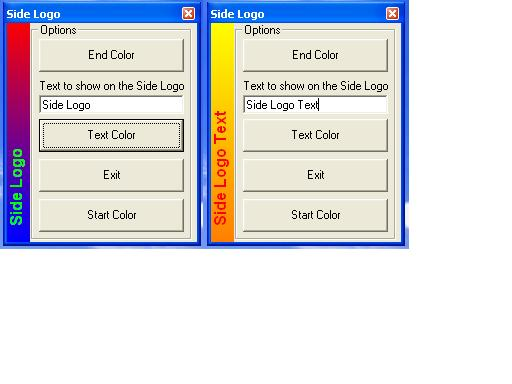



## Side Logo

### Description

It puts sideways text in the form and allows you to add a gradient background and text change text

I Take no credit for this. All i done was added some features to it.
 
### More Info
 

             |
---                |---
**Submitted On**   |2007-02-16 01:50:02
**By**             |[BJ](https://github.com/Planet-Source-Code/PSCIndex/blob/master/ByAuthor/bj.md)
**Level**          |Intermediate
**User Rating**    |5.0 (15 globes from 3 users)
**Compatibility**  |VB 6\.0
**Category**       |[Miscellaneous](https://github.com/Planet-Source-Code/PSCIndex/blob/master/ByCategory/miscellaneous__1-1.md)
**World**          |[Visual Basic](https://github.com/Planet-Source-Code/PSCIndex/blob/master/ByWorld/visual-basic.md)
**Archive File**   |[Side\_Logo2048072162007\.zip](https://github.com/Planet-Source-Code/bj-side-logo__1-67872/archive/master.zip)

